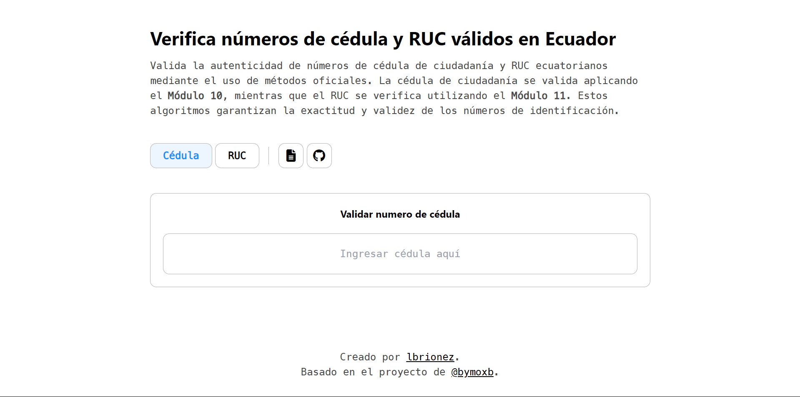

<h1 align="center">
  Validación de Cédula y RUC en Ecuador
</h1>

  <a href="https://ciruc.brionex.xyz/">Accede a la herramienta</a>

  

## Descripción

Este proyecto implementa algoritmos para la validación de la cédula de ciudadanía ecuatoriana y el RUC (Registro Único de Contribuyentes). Utiliza el método de **Módulo 10** para la cédula y el método de **Módulo 11** para validar el RUC, aplicable a personas naturales y sociedades.

## Características

- **Validación de Cédula**: Verifica cédulas ecuatorianas con un formato de 10 dígitos.
- **Validación de RUC**: Soporta validación para:
  - Personas naturales
  - Sociedades
  - Entidades públicas

## Tecnologías Utilizadas

Este proyecto utiliza las siguientes tecnologías y librerías:

- **HTML**: Estructura del contenido web.
- **CSS**: Estilos y diseño de la página.
- **JavaScript**: Funcionalidad y validación.
- **Markdown**: Documentación del proyecto.
- **Font Awesome**: Iconos para la interfaz de usuario.
- **marked.js**: Procesamiento de Markdown.