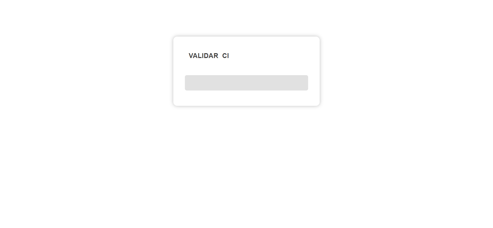

<h1 align="center">
  Validación de Cédula y RUC en Ecuador
</h1>

Este proyecto implementa algoritmos para la validación de la cédula de ciudadanía ecuatoriana utilizando el método de **Módulo 10** y el RUC (Registro Único de Contribuyentes) utilizando el método de **Módulo 11** para personas naturales y sociedades.

[Accede a la herramienta](https://lbrionez.github.io/validate-ci-ruc/).

## Validación de la Cédula de Ciudadanía

### Formato de la Cédula Ecuatoriana
La cédula consta de 10 dígitos:
- **Primeros dos dígitos**: Provincia de emisión (0-24).
- **Tercer dígito**: Número entre 0 y 5.
- **Dígitos 4 a 9**: Número consecutivo.
- **Dígito 10**: Dígito verificador.

- **Coeficientes para el Dígito Verificador**:
  - Usados en el **Módulo 10**: `2, 1, 2, 1, 2, 1, 2, 1, 2`.

### Algoritmo de Validación de Cédula de Ciudadanía

1. **Extraer los dígitos**: Toma los primeros 9 dígitos de la cédula.
2. **Multiplicar y Ajustar**: Multiplica cada dígito por su coeficiente correspondiente. Si el resultado de la multiplicación es mayor o igual a 10, resta 9.
3. **Sumar**: Suma los productos ajustados.
4. **Calcular módulo 10**: Obtén el módulo 10 de la suma total (`suma % 10`).
5. **Determinar dígito verificador**:
   - Resta el resultado del módulo 10 de 10 (`10 - módulo`).
   - Si el resultado es 10, el dígito verificador es 0.
6. **Comparar**: Verifica si el dígito verificador calculado coincide con el décimo dígito de la cédula.

### Ejemplo de Cálculo

Supongamos que la cédula es `1712345678`.

| Dígito de la Cédula | Coeficiente | Producto | Producto Ajustado |
|--------------------|-------------|----------|--------------------|
| 1                  | 2           | 2        | 2                  |
| 7                  | 1           | 7        | 7                  |
| 1                  | 2           | 2        | 2                  |
| 2                  | 1           | 2        | 2                  |
| 3                  | 2           | 6        | 6                  |
| 4                  | 1           | 4        | 4                  |
| 5                  | 2           | 10       | 1 (10 - 9)         |
| 6                  | 1           | 6        | 6                  |
| 7                  | 2           | 14       | 5 (14 - 9)         |
| **Total**          |             | **53**   | **39**             |

- **Paso 4**: Calcula el módulo 10 de la suma total ajustada (`39 % 10 = 9`).
- **Paso 5**: Determina el dígito verificador esperado (`10 - 9 = 1`).
- **Paso 6**: Compara el dígito verificador calculado con el dígito verificador de la cédula. En este caso, el dígito verificador esperado es `1`.

> En este caso, el dígito verificador de la cédula de ejemplo no coincide, por lo tanto no es válido.

## Validación del RUC

### Formato del RUC
El RUC consta de 13 dígitos y sigue un esquema similar al de la cédula con el método de **Módulo 11**. La validación incluye:
- Primeros dígitos: Tipo de contribuyente y número de identificación.
- Últimos dígitos: Dígito verificador.

### Algoritmo de Validación del RUC

1. **Extraer los dígitos**: Toma los primeros 12 dígitos del RUC.
2. **Multiplicar y Ajustar**: Multiplica cada dígito por su coeficiente correspondiente. Si el resultado de la multiplicación es mayor o igual a 10, resta 9.
3. **Sumar**: Suma los productos ajustados.
4. **Calcular módulo 11**: Obtén el módulo 11 de la suma total (`suma % 11`).
5. **Determinar dígito verificador**:
   - Resta el resultado del módulo 11 de 11 (`11 - módulo`).
   - Si el resultado es 11, el dígito verificador es 0.
   - Si el resultado es 10, el dígito verificador es 1.
6. **Comparar**: Verifica si el dígito verificador calculado coincide con el dígito verificador del RUC.

